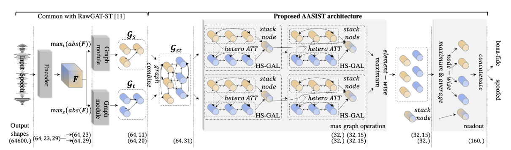

# AASIST: Audio Anti-Spoofing Using Integrated Spectro-Temporal Graph Attention Networks

Original Paper: [AASIST: Audio Anti-Spoofing Using Integrated Spectro-Temporal Graph Attention Networks](https://arxiv.org/abs/2110.01200)

	
	 <em>Figure 1. AASIST model architecture.</em>

## ✨ What's New
The work introduces the **Heterogeneous Stacking Graph Attention Layer (HS-GAL)** as an enhancement to the prior RawGAT-ST model. HS-GAL has two key components:
1. **Heterogeneous Attention** – learns cross-domain (time–frequency) relationships with direction-specific projections.
2. **Stack Node** – aggregates and propagates joint temporal–spectral information across layers.

### 🧠 Heterogeneous Attention
Uses three separate projection weight sets to compute attention over a heterogeneous graph consisting of temporal and spectral nodes:
1. Time → Time
2. Frequency → Frequency
3. Time ↔ Frequency (bidirectional, symmetric sharing)
This design allows richer cross-domain feature interaction than simple element-wise fusion.

### 🧱 Stack Node
The stack node acts as a global accumulator capturing mixed temporal–spectral artefacts. It gathers heterogeneous messages and redistributes them, enabling deeper propagation of spoofing cues.

## 🎯 Why It Matters
Integrating structured temporal–spectral relations helps expose subtle artefacts indicative of spoofing systems. The proposed architecture reports up to ~20% relative improvement over the previous state-of-the-art baseline.

## 📚 Literature Gap
Prior RawGAT-ST handled temporal and spectral graphs separately; fusion relied on simple element-wise combination followed by fully connected classification. This shallow fusion limited exploitation of nuanced cross-domain correlations.

## 🛠️ Gap Closure
HS-GAL replaces naive fusion with explicit heterogeneous attention plus a stack node that repeatedly mixes and re-injects joint representations, enabling finer discrimination of spoofing artefacts across domains.

## 🏆 Results
The model achieves state-of-the-art performance; even a published lightweight variant surpasses earlier baselines, indicating efficiency gains without excessive accuracy loss.

## 📂 Data
Experiments use the ASVspoof 2019 Logical Access (LA) dataset. Inputs are raw 4‑second waveform segments (or zero-padded / clipped to duration) processed into time and frequency graphs.

## ⚠️ Limitations
* Computational cost: Graph attention layers increase FLOPs and training time, making reproduction harder on limited GPUs.
* Hardware dependency: Original experiments used NVIDIA V100; constrained hardware may require batch size reduction or gradient accumulation.
* Potential memory overhead from maintaining heterogeneous adjacency and stack interactions.
* Paper focuses on performance; limited ablation on robustness to unseen spoofing methods or noise/reverberation.

